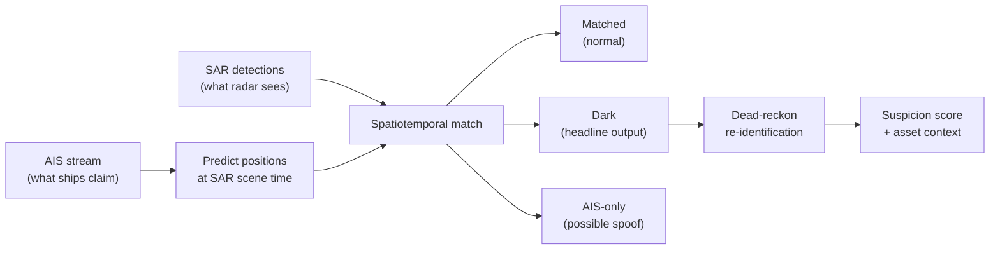

# DarkWake

**Detect vessels that go dark on AIS by fusing self-reported positions with independent satellite radar.**

DarkWake compares two maritime signals that fail in opposite directions: **AIS** (what ships broadcast about themselves) and **SAR** (what Sentinel-1 radar actually sees). When radar shows a vessel where no AIS track exists, when AIS shows a vessel in a location that it is not, or when AIS is turned on and off abnormially DarkShip detects these events and uses them to identify dark ships and abnormal behavior. This system is specifically design to support monitoring over key sub telecommuncation cables.

The primary demo targets the **Gulf of Finland cable corridor**, where Baltic undersea infrastructure and recent cable incidents.

---

## The problem

AIS is rich and continuous, but it is self-reported. A vessel can switch off its transponder or spoof its identity. SAR is sparse (a snapshot every few days) but independent.


| Signal             | Meaning                                              |
| ------------------ | ---------------------------------------------------- |
| SAR + matching AIS | Normal vessel, accounted for                         |
| **SAR, no AIS**    | **Dark ship** - physically present, not broadcasting |
| AIS, no SAR        | Possible spoof or coverage edge (later, caveated)    |


DarkWake does not guess. It correlates the two sources in space and time, then surfaces contacts that radar sees and AIS does not.

---

## How it works




**Phase 0 (complete)** validated that both data sources overlap for the chosen area and time window.

**Phase 1 (in progress)** adds replay visualization — AIS vessels on a map with play/pause/scrub controls. No fusion yet.

**Phases 2–5** add gap detection, SAR matching, re-identification, and cable-proximity behavioral rules.

---

## Why Gulf of Finland

The engine is location-agnostic (bbox is config, not code), but the default AOI is the Finland–Estonia crossing:

- **58.5–60.3°N, 23.0–27.0°E** — Gulf of Finland plus southern approach waters where GFW SAR has coverage (expanded from 59.3°N after Phase 0 spike; cable corridor 59.3–60.3°N remains inside)
- Active sabotage backdrop (Balticconnector 2023, Estlink 2 2024, Elisa cable 2025)
- Undersea cables to draw as protected assets in later phases

An alternate high-impact AOI (Strait of Hormuz) is documented in the spec for a messier, higher-stakes demo.

---

## Tech stack


| Layer      | Choice                    | Role                                                 |
| ---------- | ------------------------- | ---------------------------------------------------- |
| Backend    | Python 3.11+              | Ingest, fusion, scoring                              |
| Database   | PostgreSQL 15 + PostGIS   | Spatial matching, asset proximity *(Phase 1+)*       |
| AIS ingest | `httpx`, Polars           | Digitraffic live, Baltic CSV, AISStream *(Phase 1+)* |
| SAR ingest | GFW REST API via `httpx`  | Sentinel-1 vessel detections                         |
| Geometry   | Shapely, GeoPandas        | Interpolation, distance, asset buffers *(Phase 2+)*  |
| API        | FastAPI + uvicorn         | REST + WebSocket replay *(Phase 1+)*                 |
| Frontend   | React + Vite + TypeScript | Operational map UI *(Phase 1+)*                      |
| Map        | deck.gl + MapLibre GL JS  | Vessel tracks, SAR layer, dark contacts *(Phase 1+)* |


Phase 0 used `httpx`, `python-dotenv`, and pytest only. Phase 1 adds PostGIS, FastAPI, and the React map stack.

---

## Project layout

```
backend/
  app/
    config/       AOI bbox, thresholds, settings
    db/           PostGIS models + migrations
    ingest/       AIS CSV + GFW SAR pull + DB loader
    replay/       Replay clock + DB position source
    api/          REST + WebSocket handlers
    main.py       FastAPI entry
  tests/          pytest fixtures
scripts/
  pull_ais.py     AIS data pull CLI
  pull_sar.py     GFW SAR pull CLI
  load_ais.py       Load AIS JSON into PostGIS
  load_live_ais.py  Pull + load live Digitraffic snapshot (~600+ vessels)
  record_ais.py     Poll Digitraffic to build replayable tracks
  spike_overlap.py   Overlap check CLI
frontend/         React + deck.gl map UI
data/             Runtime pulls (gitignored)
docs/             Design spec and build plans
```

**AOI defaults** live in `backend/app/config/aoi.py`:

- Gulf of Finland (expanded for GFW SAR coverage): **58.5–60.3°N, 23.0–27.0°E**
- Default Phase 0 window: **2022-06-01 → 2022-06-30** (confirmed overlap)

**Phase 0 status:** PASS — 12 SAR detections and 6 AIS positions; overlapping scene `2022-06-17T04:00:00Z`.

---

## Prerequisites

You need **one** of these database options:

| Option | Install |
|--------|---------|
| **A — Local (no Docker)** | Run `npm run setup` once (installs Homebrew **PostgreSQL 17** + PostGIS) |
| **B — Docker** | Install [Docker Desktop for Mac](https://www.docker.com/products/docker-desktop/), then `docker compose up --build` |

You also need **Node.js 18+** (`node -v`) and **Python 3.11+** (`python3 --version`).

---

## Setup

From the repo root:

```bash
npm run setup
source .venv/bin/activate
cp .env.example .env   # if setup didn't already; add GFW_API_TOKEN=
```

`npm run setup` creates the Python venv, installs backend + frontend deps, and if Docker is missing it installs **PostgreSQL 16 + PostGIS via Homebrew** and runs the DB migration.

If setup fails at "Starting PostgreSQL" or PostGIS extension errors, the brew packages may still be installed. Homebrew **postgis only supports PostgreSQL 17/18** (not 16). Finish with:

```bash
brew install postgresql@17
brew services stop postgresql@16   # if an older server is still running
bash scripts/finish_db_setup.sh
```

Phase 0 gate (optional):

```bash
python scripts/run_phase0_gate.py
```

---

## Phase 1 quickstart

**Terminal 1 — backend**

```bash
source .venv/bin/activate
bash scripts/start_backend.sh
```

**Terminal 2 — map UI**

```bash
npm run dev
```

Open http://localhost:5173 — press **Play** to replay vessels.

**Load AIS data** (once, after backend DB is up):

```bash
# Dense live corridor traffic (~600+ vessels) — recommended for Phase 1 demo
python scripts/load_live_ais.py --clear

# Or record tracks over time for replay / Phase 2 gap detection
python scripts/record_ais.py --to-db --clear --interval 300
# Let it run 30–60+ min, then replay
```

Historical Phase 0 pull (sparse, SAR-aligned window only):

```bash
python scripts/pull_ais.py --source digitraffic
python scripts/load_ais.py data/ais_*.json --clear --live
```

### With Docker (if installed)

```bash
docker compose up --build
# then in another terminal:
npm run dev
```

### Build frontend only

```bash
npm run build
```

Output lands in `frontend/dist/`.

---

## License

TBD.