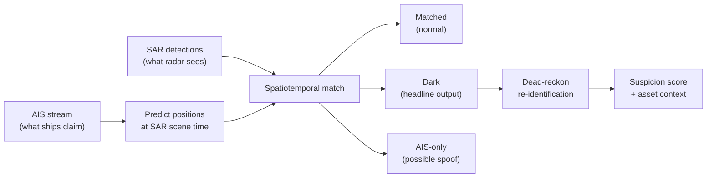

# DarkWake

**Detect vessels that go dark on AIS by fusing self-reported positions with independent satellite radar.**

DarkWake compares two maritime signals that fail in opposite directions: **AIS** (what ships broadcast about themselves) and **SAR** (what Sentinel-1 radar actually sees). When radar shows a vessel where no AIS track exists, when AIS shows a vessel in a location that it is not, or when AIS is turned on and off abnormially DarkShip detects these events and uses them to identify dark ships and abnormal behavior. This system is specifically design to support monitoring over key sub telecommuncation cables.

The primary demo targets the **Gulf of Finland cable corridor**, where Baltic undersea infrastructure and recent cable incidents.

---

## The problem

AIS is rich and continuous, but it is self-reported. A vessel can switch off its transponder or spoof its identity. SAR is sparse (a snapshot every few days) but independent.


| Signal             | Meaning                                              |
| ------------------ | ---------------------------------------------------- |
| SAR + matching AIS | Normal vessel, accounted for                         |
| **SAR, no AIS**    | **Dark ship** - physically present, not broadcasting |
| AIS, no SAR        | Possible spoof or coverage edge (later, caveated)    |


DarkWake does not guess. It correlates the two sources in space and time, then surfaces contacts that radar sees and AIS does not.

---

## How it works




**Phase 0 (current)** validates that both data sources overlap for a chosen area and time window — the hard prerequisite before any fusion logic ships.

**Phases 1–5** add replay visualization, gap detection, SAR matching, re-identification, and cable-proximity behavioral rules. See [Roadmap](#roadmap) below.

---

## Why Gulf of Finland

The engine is location-agnostic (bbox is config, not code), but the default AOI is the Finland–Estonia crossing:

- **58.5–60.3°N, 23.0–27.0°E** — Gulf of Finland plus southern approach waters where GFW SAR has coverage (expanded from 59.3°N after Phase 0 spike; cable corridor 59.3–60.3°N remains inside)
- Active sabotage backdrop (Balticconnector 2023, Estlink 2 2024, Elisa cable 2025)
- Undersea cables to draw as protected assets in later phases

An alternate high-impact AOI (Strait of Hormuz) is documented in the spec for a messier, higher-stakes demo.

---

## Tech stack


| Layer      | Choice                    | Role                                                 |
| ---------- | ------------------------- | ---------------------------------------------------- |
| Backend    | Python 3.11+              | Ingest, fusion, scoring                              |
| Database   | PostgreSQL 15 + PostGIS   | Spatial matching, asset proximity *(Phase 1+)*       |
| AIS ingest | `httpx`, Polars           | Digitraffic live, Baltic CSV, AISStream *(Phase 1+)* |
| SAR ingest | GFW REST API via `httpx`  | Sentinel-1 vessel detections                         |
| Geometry   | Shapely, GeoPandas        | Interpolation, distance, asset buffers *(Phase 2+)*  |
| API        | FastAPI + uvicorn         | REST + WebSocket replay *(Phase 1+)*                 |
| Frontend   | React + Vite + TypeScript | Operational map UI *(Phase 1+)*                      |
| Map        | deck.gl + MapLibre GL JS  | Vessel tracks, SAR layer, dark contacts *(Phase 1+)* |


Phase 0 is intentionally lean: `httpx`, `python-dotenv`, and pytest — no database or frontend yet.

---

## Project layout

```
backend/
  app/
    config/       AOI bbox, thresholds, settings
    ingest/       AIS CSV + GFW SAR pull logic
    spike_overlap.py   Phase 0 overlap gate
  tests/          pytest fixtures for ingest + spike
scripts/
  pull_ais.py     AIS data pull CLI
  pull_sar.py     GFW SAR pull CLI
  spike_overlap.py   Overlap check CLI
frontend/         Map UI (Phase 1)
data/             Runtime pulls (gitignored)
docs/             Design spec and build plans
```

**AOI defaults** live in `backend/app/config/aoi.py`:

- Gulf of Finland (expanded for GFW SAR coverage): **58.5–60.3°N, 23.0–27.0°E**
- Default Phase 0 window: **2022-06-01 → 2022-06-30** (confirmed overlap)

**Phase 0 status:** PASS — 12 SAR detections and 6 AIS positions; overlapping scene `2022-06-17T04:00:00Z`.

---

## Setup

From the repo root (use **one** venv here — scripts expect it):

```bash
python3 -m venv .venv
source .venv/bin/activate
pip install -e ".[dev]"
pip install -e "./backend[dev]"
cp .env.example .env   # add GFW_API_TOKEN=
```

Then run the Phase 0 gate:

```bash
python scripts/run_phase0_gate.py
```

If you see `ModuleNotFoundError: No module named 'dotenv'`, the venv is missing deps — run the `pip install` lines above.

---

## License

TBD.